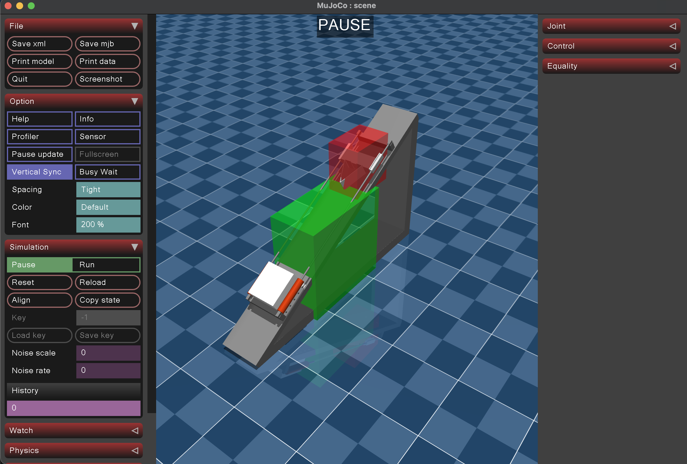

## Physics Simulation Engine

Used MuJoCo to simulate the kinematics of a wedge sliding down a ramp to test how different bumper designs affect acceleration. 
The goal of the project was to maximize the impulse delivered by the bumper, and simulation enabled rapid iteration by modifying CAD models instead of rebuilding full physical prototypes. 
Developed the model in Onshape with assigned material properties to ensure realistic world modeling. 
Added collision detection and realistic contact dynamics to accurately evaluate system behavior under various conditions.

